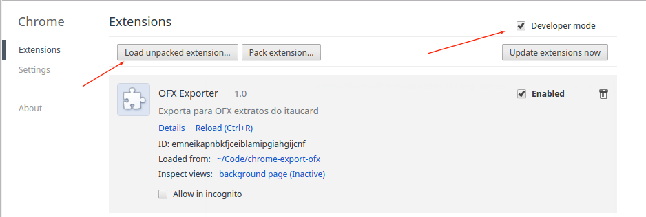

# Export OFX

Essa é uma extensão do Chrome para exportar extratos dos cartões de crédito em um formato OFX (ainda para uso pessoal)

Hoje exporta os seguintes extratos:

* Itaucard
* AmericanExpress

## Como usar

Não publiquei o plugin ainda. Para utilizar, baixe esse repositório e inclua no chrome:

* Vá em chrome://extensions/
* Clique em "Developer Mode"
* E em "Load unpacked extension"
 

O ícone exporta o extrato que você estiver visualizando em .ofx

